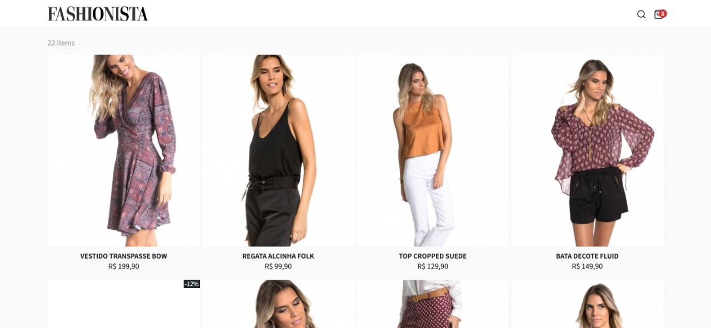
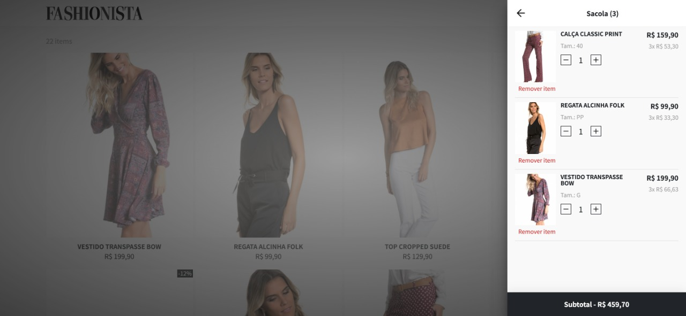

# Fashionista E-commerce

## Introdução

Esse projeto foi desenvolvido durante a aceleração de React promovida pela [Codenation](https://www.codenation.dev/), atual [TryBe](https://www.betrybe.com/). Ao todo foram 9 módulos mais o projeto final, descrito [abaixo](#Cenário). 

Clique :link: [aqui](https://codenation-react.netlify.app/) para avaliar meu projeto no netlify. 

 

## Cenário

Segundo o levantamento, da Webshoppers (Ebit / Nielsen), os e-commerces brasileiros faturaram cerca de R$ 53,2 bilhões em 2018. O segmento **“Moda e Acessórios”** representa **5,6%** do faturamento no varejo online, ocupando a segunda posição entre as categorias de produtos com mais pedidos, perdendo apenas para o segmento de **eletroeletrônicos**.

Oferecer a melhor experiência aos usuários que interagem com os produtos no desktop, e principalmente em dispositivos móveis, é fundamental para se manter vivo e competitivo nesse segmento.

## Objetivo

Como um profissional front-end, você será responsável por desenvolver as **principais funcionalidades** de um e-commerce de moda feminina, o **Fashionista**, garantindo a melhor experiência possível para os usuários interagirem com os produtos.

## Regras

  
:point_right: Deve implementar as funcionalidades apresentadas nos wireframes / layouts. :heavy_check_mark:

:point_right: Deve ser mobile first, possuindo uma experiência satisfatória tanto em mobile quanto em desktop. :heavy_check_mark:

:point_right: Deve consumir a API do catálogo de produtos. :x:

:point_right: O estado global da aplicação deverá ser gerenciado com Redux. :heavy_check_mark:

:point_right: Deve ser um SPA (Single Page Application). :heavy_check_mark:

:point_right: Todos os produtos da API devem ser exibidos. :x:

:point_right: Utilize BEM CSS para escrever os estilos. :x:

:point_right: Deve-se fazer deploy do projeto, servindo-o no Netlify. :heavy_check_mark:

:point_right: Não utilize frameworks CSS como Bootstrap, Foundation e afins. :heavy_check_mark:

## Requisitos obrigatórios

:point_right: Para cada item do catálogo de produtos as seguintes informações devem estar na página:

  * Imagem :point_left:  :heavy_check_mark:
  
  * Nome :point_left: :heavy_check_mark:
  
  * Preço :point_left: :heavy_check_mark:
  
  * Status “Em promoção” :point_left: :heavy_check_mark:
  
  * Preço promocional (se disponível) :point_left: :heavy_check_mark:
  
  * Tamanhos disponíveis :point_left: :heavy_check_mark:
  
  * Selo “Promoção” :point_left: :heavy_check_mark:
  
:point_right: Deve ser possível adicionar itens por tamanho no carrinho de compras. :heavy_check_mark:

:point_right: Deve ser possível visualizar os itens adicionados no carrinho de compras, exibindo imagem, nome, preço e quantidade. :heavy_check_mark:

:point_right: Deve ser possível remover itens do carrinho de compras. :heavy_check_mark:

## Requisitos opcionais

:point_right: O carrinho de compras deve persistir entre reloads de página. :heavy_check_mark:

:point_right: Alguns produtos não tem todos os tamanhos disponíveis, mostre apenas os tamanhos disponíveis em estoque. :heavy_check_mark:

:point_right: Implemente a funcionalidade de busca em tempo real. :heavy_check_mark:

## Endpoint - Catálogo de Produtos

:link: https://5f074b869c5c250016306cbf.mockapi.io/api/v1/catalog

## Deploy

A recomendação é para que o deploy seja feito no netilify (gratuito) ou serviço similar - https://www.netlify.com/

## Layouts

Os layouts abaixo servem de referência visual das funcionalidades, sintam-se livres para segui-las ou implementá-las com base em outras referências, desde que atenda às regras e aos requisitos obrigatórios.

### Layouts: Referência Navegável

https://viniciusvinna.netlify.app/react-fashionista

### Layouts: Home (catálogo)

### Layouts: Página do produto

### Layouts: Indicador de produtos no ícone do carrinho

### Layouts: Carrinho de compras aberto

### Layouts: Busca em tempo real

